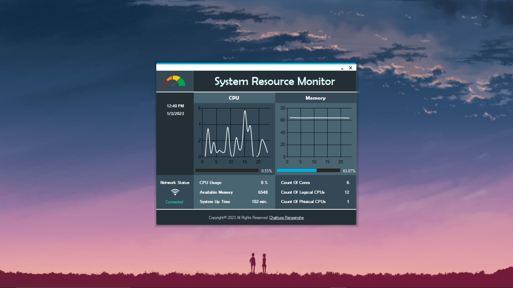

# System Resource Monitor

## Description

The System Resource Monitor is an application developed using Visual Studio and .NET Framework by a group of Computer Science undergraduate students, at Eastern University. This application provides a user-friendly graphical interface that displays the current usage of system resources, including CPU and memory usage, network connectivity, available memory, system uptime, count of logical and physical cores, and date and time.

## Getting Started

Prerequisites

This application can be installed on any Windows version.
.NET 6.0 Desktop Runtime (v6.0.7) is required. You can download it from the official Microsoft website: https://dotnet.microsoft.com/en-us/download/dotnet/thank-you/runtime-desktop-6.0.7-windows-x64-installer

## Installation

To install the System Resource Monitor application, follow these steps:

*Download the application from the GitHub repository.
*Double-click on the "converter.exe" file.
*Follow the installation wizard to complete the installation.
Usage
*Once the application is installed, you can launch it from the Start menu or desktop shortcut. The System Resource Monitor will display real-time information about your system resources in an easy-to-understand graphical format. If you encounter any issues or have questions about the application, please refer to the "Help" section below.

## Help

If you need assistance with the System Resource Monitor application, please contact us at the following email address: [insert contact email here]. We will be happy to assist you with any issues or questions you may have.

## Authors

*Chathura Ranasinghe
*Malith Keerthisinghe
*Thilina Lakshan

## Version History

0.1 - Initial Release

## License

This project is licensed under the GNU Affero General Public License v3.0. For more information, please refer to the "LICENSE.md" file.
